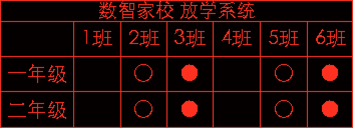
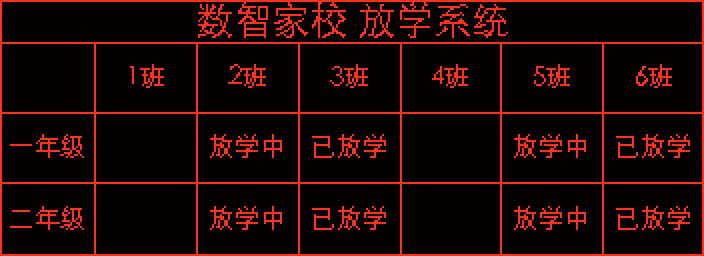

# 放学展示 LED 屏像素与分页选型指南

适用范围：P10 单色屏、行政班表格、顶部标题、单个横向分区、班级列为“1班、2班…”、当前版本的自动字号。以下尺寸是**选型起点**，不是不经现场验收即可采购的保证值。不同字体、班名、状态文案、观看距离及控制卡屏参都会改变结果。

## 先定可读性口径

查看预览中的“本页实际字号”，以最小的行列标题或状态字号为准：

| 实际字号 | 选型判断 |
| --- | --- |
| 小于 12 px | 不建议使用；截图中 5–6 px 属于明显不可读。 |
| 12–15 px | 风险区；只能现场试读，不能按放大后的电脑预览判断。 |
| 16–17 px | 本指南的最低选型线。 |
| 18–20 px 及以上 | 优先争取的范围，仍需按实际观看距离试读。 |

这是本系统针对校门放学表格提出的验收口径，并非 P10 行业统一字号标准。100% 只表示当前内容在当前画面中能放下的最大字号；若最大只有 5 px，继续调字号不会凭空增加屏幕像素。

## 尺寸看单页内容

总共有六个年级，若每页展示两个年级，就按“2 年级/页”选屏，轮播三页。班级列数按**单个年级的最大班级数**算：某年级有六个班，就按六列算。自定义页面也一样；把六个年级放在同一页，就必须按六行选型。

下面是当前渲染器用常见年级名、数字班号和顶部标题模拟的**建议起点**。尺寸按常见 32×16 点 P10 模组取整，并留出一定横向余量；表格实际字号约 17–23 px。圆点文案示例：未放学留空、放学中 `○`、已放学 `●`。完整文案示例：放学中、已放学。

| 单页年级数 | 每级最多班数 | 状态用 `○/●` | 状态用完整文字 | 需要的页面数（六个年级） |
| --- | ---: | ---: | ---: | ---: |
| 1–2 | 2 班 | 192×128 | 224×128 | 3–6 页 |
| 1–2 | 4 班 | 256×128 | 352×128 | 3–6 页 |
| 1–2 | 6 班 | 320×128 | 448×128 | 3–6 页 |
| 1–2 | 8 班 | 384×128 | 576×128 | 3–6 页 |
| 3 | 2 班 | 192×192 | 224×192 | 2 页 |
| 3 | 4 班 | 256×192 | 352×192 | 2 页 |
| 3 | 6 班 | 320×192 | 448×192 | 2 页 |
| 3 | 8 班 | 384×192 | 576×192 | 2 页 |

表内的“最多班数”按均匀数字班号模拟。若班名较长、标题较长、还显示社团班，或文字大小滑杆低于 100%，须重新生成真实数据预览；社团班采用另一种表格布局，应单独验收。超过八个班不能直接套表，应先在预览中测算。选择圆点时，还应在现场提供“○/●”所代表状态的说明。

### 固定宽 352 点、六个年级、每级六个班

推荐 **352×128 点**，每页两个年级，共三页，状态用 `○/●`，顶部标题，文字大小先设 100%。模拟的本页表格字号约 **20 px**、标题约 **19 px**。例如轮播页依次填“一年级、二年级”“三年级、四年级”“五年级、六年级”。

若必须保留“放学中、已放学”完整文字，352 点宽的六个班级列使表格字号仅约 **13 px**；单纯把高度从 128 加到 192 点，也无法突破列宽限制。此时建议把宽度增加到 **448×128 点**，模拟表格字号约 **17 px**。如果宽度不能改变，就使用更短的状态文案。

下图是同一块 352×128 点屏、同一组模拟班级，在电脑上放大 2 倍后的对比。放大是为了看清点阵，并不会让实体屏增加像素。

状态改用圆点，表格约 20 px：

状态保留完整文字，表格约 13 px：

不建议六个年级同页。352×96 点、六年级六班同页时，表格约 **6 px**；即使增加到 352×192 点，完整状态文字仍约 **13 px**。坚持单页并改用圆点时，352×224 点、左侧标题约可达到 **17 px**，但屏体明显更高、更贵，现场仍需试读。优先采用轮播分页。

## P10 尺寸换算与验收

常见 P10 单色模组为 **32×16 点、320×160 mm**，即点距 10 mm；实际供货模组及控制卡规格必须与供应商确认。[P10 单色模组厂家规格](https://www.matrix-display.com/led-text-signs-and-others/p10-single-color-red-led-module-32x16dots.html)

- 352×96 点约为 **3.52×0.96 m**，若用上述模组则为 11×6＝66 块。
- 352×128 点约为 **3.52×1.28 m**，则为 11×8＝88 块，比 352×96 多 22 块模组。
- 448×128 点约为 **4.48×1.28 m**，则为 14×8＝112 块。

采购前用学校真实年级、班级、标题及三种状态文案生成每一页预览，逐页检查最小实际字号；再在现场按学生和家长实际站位看实体屏，并核对控制卡分辨率、接线、模组方向和实际成品尺寸。电脑预览放大只会把像素块放大，不等于实体屏增加清晰度。
