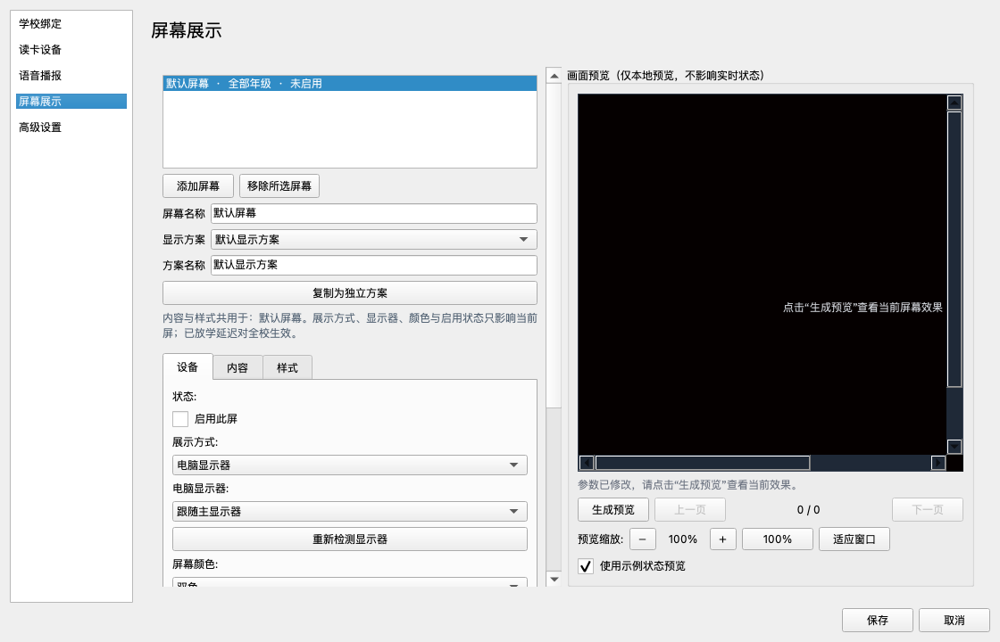
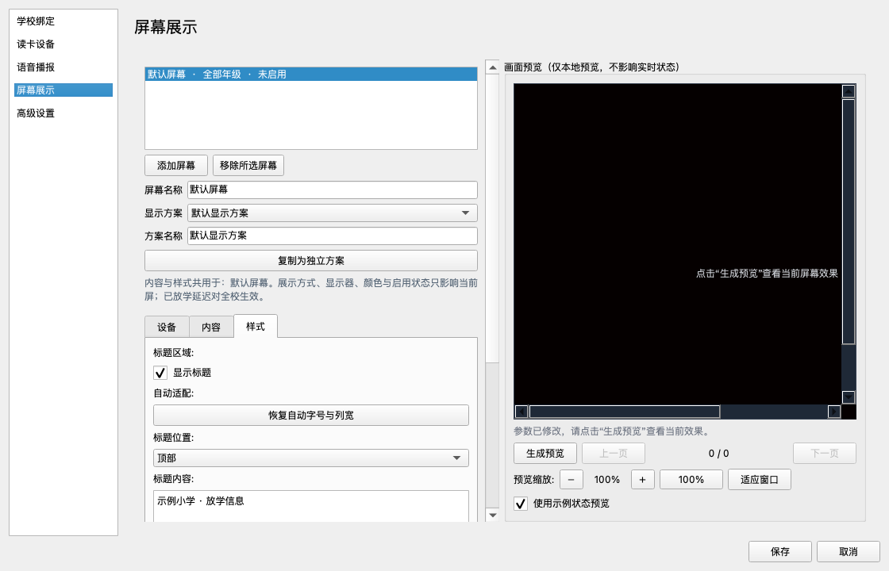
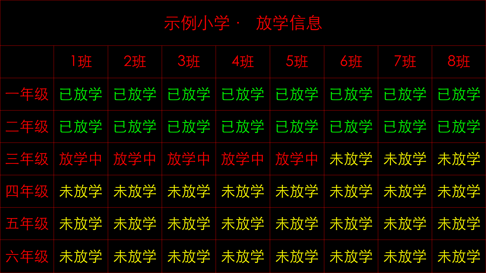
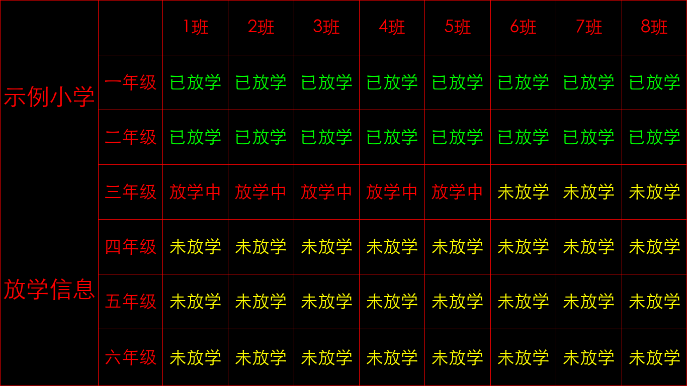
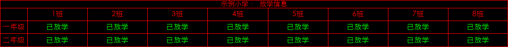
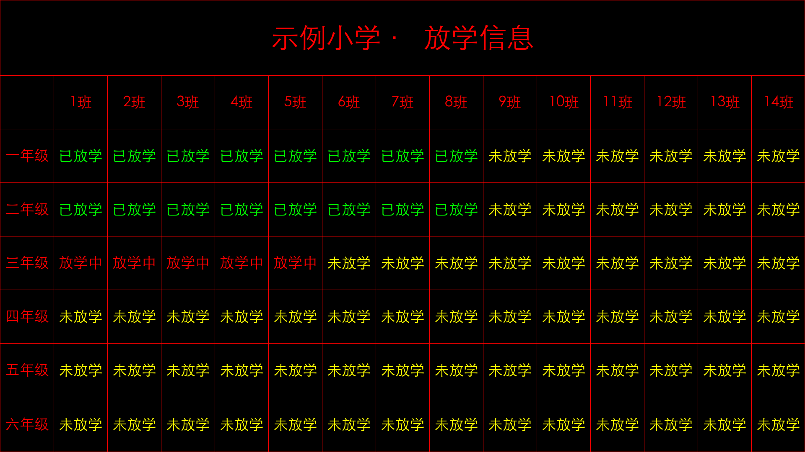

# 电脑展示与通用标题布局

基于 v2.1.0-beta.18 增量实现。LED 控制卡与同机电脑显示器共用屏幕列表和显示方案，可同时启用多块屏，也可共用或分别配置方案。

## 使用方式

1. 打开 **系统设置 → 屏幕展示**，选择已有屏幕，或点“添加屏幕”。
2. 在 **设备** 中选择“电脑显示器”，勾选“启用此屏”，选择目标显示器。可选择“跟随主显示器”或一块指定显示器。
3. 电脑默认双色：未放学为黄色、放学中为红色、已放学为绿色。像素尺寸自动读取所选显示器，包含显示缩放，不需要填写 1920×1080，也不使用 LED 控制卡的像素限制。
4. 在 **内容** 中设置年级范围、行数、分区与翻页间隔。在 **样式** 中选择标题“左侧”或“顶部”，也可关闭标题。此设置属于显示方案，**LED 屏和电脑屏均支持**。左侧标题可手动换行；顶部标题将多行合并为一行并自动缩小以适应。
5. 行列标题与状态的自动字号会结合班级列数、实际文字宽度及行高统一计算；年级列按文字宽度留白。已有手动字号作为字号上限保留；如果此前调过字号，点击“恢复自动字号与列宽”，再生成预览并保存。
6. 点击“生成预览”检查排版，或“全屏测试展示”检查目标显示器。勾选“使用示例状态预览”时使用示例状态，不改变真实班级状态。测试窗口有明确测试标记，按 Esc 返回。
7. 点击底部“保存”。正常模式按既有放学时段自动展示，时段结束后退出；系统测试模式仍遵循原有逻辑，可在时段外展示测试状态。

## 运行中的操作

- **Esc 或关闭窗口**：退出当前屏幕本次展示，不会每半秒重新弹出。可在主界面点“恢复电脑展示”，下一放学时段也会自动重新开启。
- **修改设置**：设置等模态窗口打开期间，实时电脑展示暂时隐藏，关闭后恢复；测试展示单独操作。
- **指定显示器断开**：隐藏其展示窗口，显示“显示器未连接”，不把指定屏的内容转到主屏。重新连接后自动恢复；“跟随主显示器”会跟随当前主屏。
- **分辨率或 Windows 缩放变化**：按当前所选显示器重新生成画面。
- **多个电脑展示配置指向同一物理屏**：只展示一份，其余提示占用，避免全屏窗口重叠。
- **没有班级数据或筛选结果为空**：展示明确的空状态，不沿用过期班级画面。

## 示例画面

以下均为本地生成的虚拟班级数据，不是学校实测截图。图片中的尺寸用于展示适配效果，不是程序固定分辨率。

另有 [竖屏示例](examples/pc-top-portrait.png)。

## 开发验证与待验收范围

- `python -m pytest -q`：覆盖原有 LED、读卡、播报与设置功能，以及新增加的电脑展示默认值、原生分辨率换算、标题布局、保存重开、时段切换、退出与恢复、异步结果过期、显示器断开、分页、重复显示器校验。
- `python tools/demo_desktop_display.py`：重新生成本目录中的画面与设置截图。使用临时/示例数据，不访问学校接口、不向控制卡发送指令。
- 已在 macOS 的 Qt offscreen 环境完成自动化与渲染检查；**Windows 真机、多显示器/DPI 切换、真实 LED 控制卡效果仍需现场验收**。
- 本次为源码改动，尚未发布新的 Windows 安装包或 Release。

## 实现边界

`led_output_type` 与 `led_monitor` 属于屏幕设备；`led_title_position` 属于显示方案。旧配置默认保持 LED 输出、左侧标题和原颜色。电脑输出使用独立的 Qt 展示管理器，读取同一个放学状态源；渲染放在后台线程，窗口与显示器操作只在 Qt 主线程执行。电脑输出不经过 Java LED Bridge。

服务端放学指令走 MQTT。测试电脑必须在“高级设置”勾选“启用 MQTT 心跳/指令”，并确认设备编号不为空；修改此项后重启客户端使 MQTT 连接按新配置启动。实时全屏展示右上角提供“关闭展示”鼠标按钮，也可以按 Esc；关闭后不立即自动弹回，点击主界面“恢复电脑展示”或下一放学时段可恢复。

## 排版修正（layout-fix1）

- 顶部列标题识别“1.1 班”“4.4班”“四（4）班”等写法，显示为“1班”“4班”，相同班号跨年级共用同一列；保留真实班级 ID 与状态对应关系，缺失班号不补造，命名班级不强行编号。
- 自动字号按实际文字和可用单元格共同求解，不再对年级、班号、状态各自缩放；年级列宽随文字与字号变化。
- 同一页多分区采用共同可容纳字号；手动行列标题和状态字号仍可分别设置，作为尺寸上限使用。
- 260 项自动化测试通过，已检查 8 列和 14 列电脑画面及 LED 长条画面。仍需 Windows 上使用实际学校数据复核。

