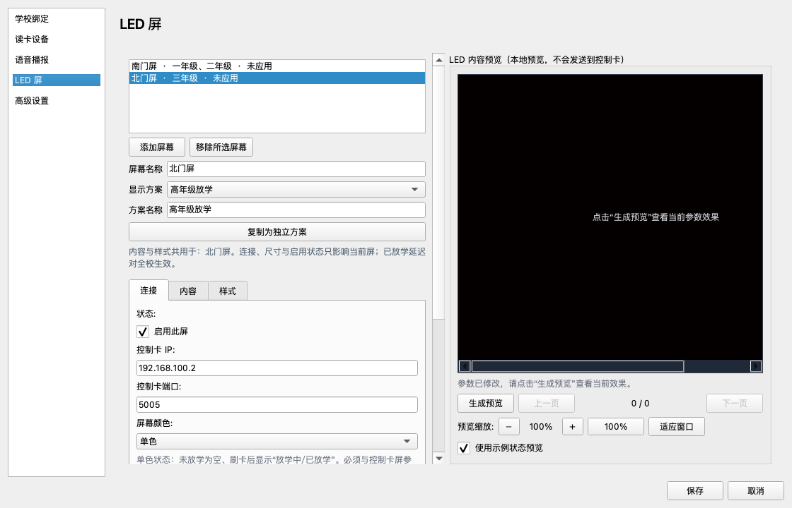
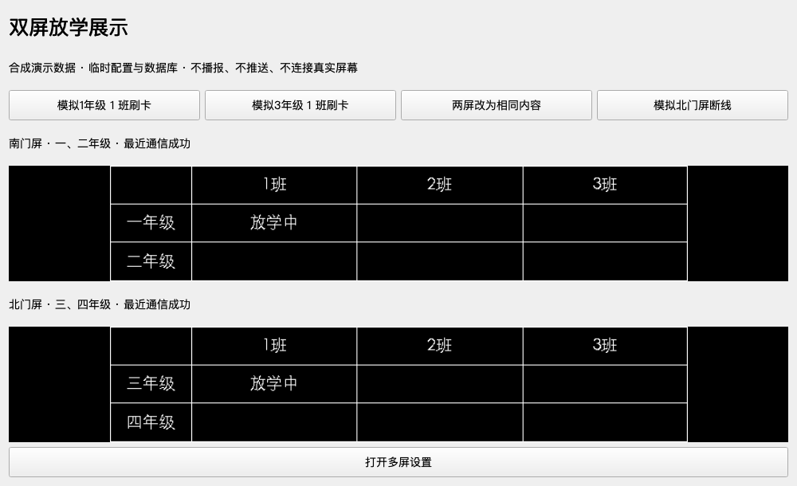

# 多屏放学展示

## 本次改动

在“系统设置 → LED 屏”中添加、选择和移除屏幕。每块屏独立保存启用状态、IP、端口、像素尺寸和颜色；显示方案保存年级范围、标题、字号、布局和翻页间隔。

- 不同内容：南门屏选择“一、二年级”方案，北门屏选择“三、四年级”方案。
- 相同内容：两块屏选择同一个显示方案；修改方案时，界面提示哪些屏幕共用。
- 部分重叠：两块屏可各自选择包含二年级的不同方案，二年级状态同时更新。
- 希望以后分别修改：点击“复制为独立方案”。
- 配置先作为草稿保存在窗口中，点击“保存”后应用；取消不会改写配置。连接测试、发送测试画面和恢复原节目是立即操作。
- 旧版单屏设置在读取时自动转换为“默认屏幕 / 默认显示方案”；首次保存后写入 `led_screens` 与 `led_display_plans`。原单屏字段保留，作为旧格式兼容信息，不作为多屏运行时的配置来源。



## 操作范围

| 操作 | 影响范围 |
| --- | --- |
| 启用此屏、连接设置、屏幕尺寸 | 当前屏幕 |
| 显示方案中的内容与样式 | 所有使用该方案的屏幕 |
| 生成预览 | 本地预览，不发送到控制卡；切换屏幕后清除旧预览 |
| 测试连接、发送测试画面、恢复此屏原节目 | 当前表单填写的屏幕地址；恢复不清空全校班级状态 |
| 重置全校今日放学状态 | 清空全校当天行政班、社团班 LED 状态，并恢复所有已配置屏幕原节目 |
| 已放学延迟 | 全校统一，保持各屏同一班级状态一致 |

年级筛选仍针对行政班；社团班按现有社团放学时段和社团布局规则显示。不同尺寸屏幕共用内容时各自排版，不承诺两块控制卡逐帧同步翻页。状态栏显示最近一次通信结果，并非持续在线探测。

## 运行逻辑

班级状态、计时器和数据库写入由一个全校服务维护；每块物理屏幕拥有独立发送队列、轮播计时器、图片目录与桥接进程。

- 一块屏阻塞时，另一块屏仍能更新。
- 连续刷新请求合并，重连后使用最新班级状态。
- 停用、移除、更换地址时，恢复旧设备原节目；失败后利用后续时段检查继续重试。
- 设备队列跟随物理 IP / 端口，即使交换屏幕地址或重新添加同一设备，也不会让旧清屏任务覆盖新发送任务。
- 退出放学时段统一清空班级状态，各屏独立恢复原节目。
- 重试在客户端运行期间进行；真实屏幕在电脑、客户端关闭后的表现仍由控制卡自身节目决定。

## 无硬件演示

在已安装项目 `requirements.txt` 的 Python 环境运行：

```bash
python tools/demo_multi_screen.py
```

演示使用临时数据库和合成的一至四年级班级数据，LED 桥接器全部替换为本地模拟器。可模拟一年级 / 三年级刷卡、切换相同或不同内容、模拟北门屏断线并恢复、打开多屏设置。演示不发送真实 LED 指令，不播报或推送放学消息；退出后删除临时配置。

```bash
python tools/demo_multi_screen.py --screenshot docs/multi-screen/demo.png
```



## 验证与现场验收

自动化回归涵盖旧配置迁移、不同/重叠年级、共享方案、单次状态入库、阻塞隔离、独立恢复、停用/移除/更换地址、失败重试、跨日状态、地址交换、连续保存、草稿隔离、失效年级保留和切屏预览清理。运行：

```bash
python -m pytest -q
```

本轮本地结果：235 项测试通过，Python 编译检查与 `git diff --check` 通过。存在 1 条既有 Pillow 测试弃用提示。独立代码复核提出的 3 个恢复重试、状态提示及设备队列复用问题均已修复并复测。

以下为 Windows 双屏现场验收清单，尚未用真实控制卡执行：

- [ ] 两屏不同内容：分别配置一、二年级与三、四年级；刷卡后对应屏显示正确。结果：____；证据：____。
- [ ] 两屏相同内容：共用一个方案；修改年级范围后两屏均生效。结果：____；证据：____。
- [ ] 不同屏参：两屏设置各自尺寸与颜色，确认字号、分区、分页无截断。结果：____；证据：____。
- [ ] 断线恢复：断开一块屏，另一块屏持续显示；恢复网络后断线屏显示最新状态。结果：____；证据：____。
- [ ] 单屏恢复：恢复一块屏原节目，另一块屏与全校班级状态不受影响。结果：____；证据：____。
- [ ] 时段退出：各屏恢复原有 Ledshow 节目，恢复失败时界面提示且后续重试。结果：____；证据：____。
- [ ] 停用和移除：旧画面不再轮播；断线时移除后，恢复网络能完成原节目恢复。结果：____；证据：____。
- [ ] 升级重启：旧单屏配置、标题、字号和年级范围保留；新多屏配置重启后仍生效。结果：____；证据：____。

多屏功能随 `v2.1.0-beta.17` 测试版发布，Windows 安装包由 GitHub Actions 构建。真实控制卡现场验收与自动化构建验证分开执行。
